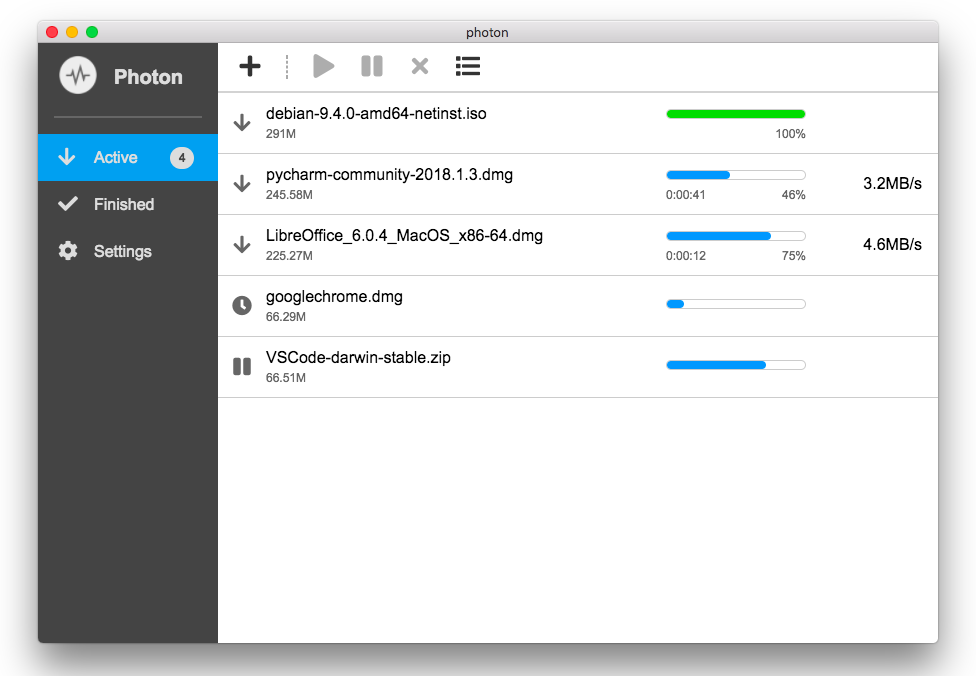

# Photon

*Photon* is a lightweight multi-threaded downloader based on [aria2](https://github.com/aria2/aria2). It supports **HTTP/HTTPS**, **Magnet links**, **BitTorrent** and **Metalink** download.

*Photon* is cross platform. It has **macOS** and **windows** releases now and will have Linux release soon.


## Screenshots

**Mac**




## Installation

Latest releases: https://github.com/alanzhangzm/Photon/releases


## Extensions

Since *Photon* uses aria2 as download core, all of the extensions that support aria2 via RPC are also *Photon* compatible.
The default RPC configuration for *Photon* and aria2:
- URL: http://127.0.0.1:6800/jsonrpc
- Address: 127.0.0.1
- Port: 6800
- Protocol: HTTP

Some popular aria2 extensions:
- [BaiduExporter](https://github.com/acgotaku/BaiduExporter)
- [ThunderLixianExporter](https://github.com/binux/ThunderLixianExporter)


## Development

``` bash
# install dependencies
npm install

# serve with hot reload at localhost:9080
npm run dev

# build electron application for production
npm run build

# run unit & end-to-end tests
npm test


# lint all JS/Vue component files in `src/`
npm run lint

```

This project was generated with [electron-vue](https://github.com/SimulatedGREG/electron-vue)@[7c4e3e9](https://github.com/SimulatedGREG/electron-vue/tree/7c4e3e90a772bd4c27d2dd4790f61f09bae0fcef) using [vue-cli](https://github.com/vuejs/vue-cli). Documentation about the original structure can be found [here](https://simulatedgreg.gitbooks.io/electron-vue/content/index.html).


## License
[Apache-2.0](https://github.com/alanzhangzm/Photon/blob/master/LICENSE)
