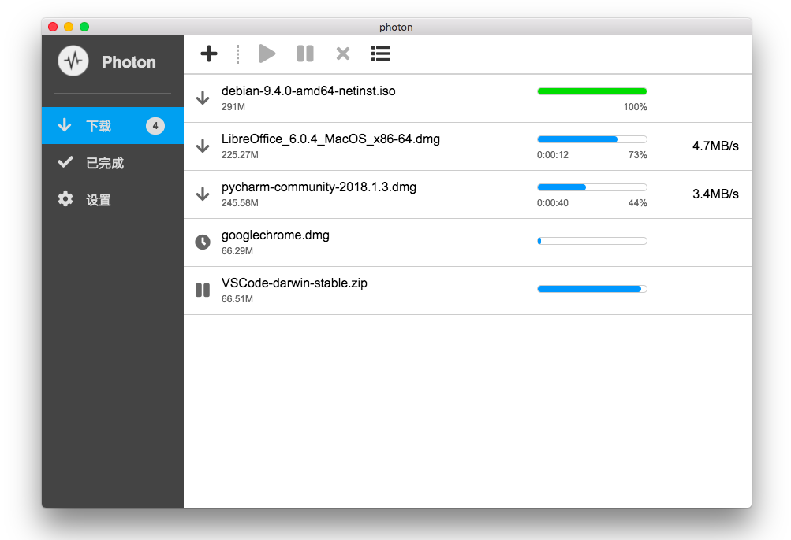

Languages: [English](https://github.com/alanzhangzm/Photon) [中文](https://github.com/alanzhangzm/Photon/blob/master/README.zh-CN.md)

# Photon

*Photon* 是一款基于 [aria2](https://github.com/aria2/aria2) 的多线程下载软件，支持 **HTTP/HTTPS**，**磁力链**，**BT** 和 **Metalink**。

*Photon* 现发行于 **macOS** 和 **Windows** 平台，即将发布 Linux 版。

如果你想要一个管理 aria2 的网页前端，请尝试 [*Photon WebUI*](https://github.com/alanzhangzm/Photon-WebUI/blob/master/README.zh-CN.md)。

## 截图

**Mac**

## 安装

最新稳定版: https://github.com/alanzhangzm/Photon/releases

## 插件

因为 *Photon* 的下载核心是 aria2，所有基于 RPC 协议的 aria2 插件都同样适用于 *Photon*。

*Photon* 和 aria2 默认的 RPC 配置：
- URL: http://127.0.0.1:6800/jsonrpc
- 地址: 127.0.0.1
- 端口: 6800
- 协议: HTTP

常用的插件:
- 百度云下载插件：[BaiduExporter](https://github.com/acgotaku/BaiduExporter)
- 迅雷离线下载插件：[ThunderLixianExporter](https://github.com/binux/ThunderLixianExporter)
- 115网盘下载插件：[115](https://github.com/acgotaku/115)

## 许可证
[Apache-2.0](https://github.com/alanzhangzm/Photon/blob/master/LICENSE)
